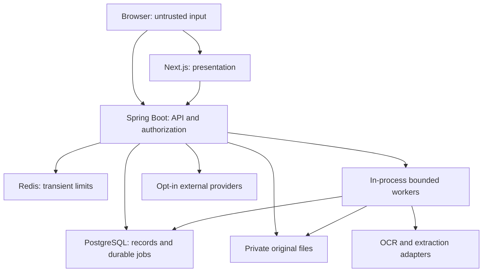

# CarePath architecture

**CarePath — Evidence-Grounded Longitudinal Health Record Intelligence & Care Navigation Platform**

Status: Phases 1–11 implemented to the scoped limits recorded in PROJECT_STATUS.md; Phase 12 adds production safeguards and verification. Early sections labelled target describe historical design intent. Later implementation sections supersede them, especially immutable Visit Pack retention after source changes/deletion.
PROJECT_STATUS.md is the implementation ledger; docs/AUTHENTICATION.md describes implemented authentication.

## Scope and central contribution

Transform fragmented user documents into structured, comparable longitudinal observations
with source evidence and explicit uncertainty. Help users understand records, prepare clinical
questions/visit packs and navigate care. No diagnosis, prescribing, dosage advice or invented
facilities. AI is an explanation provider; PostgreSQL holds the authoritative record.

## Deployment and trust boundaries

One Java 21/Spring Boot modular monolith, one Next.js application, PostgreSQL and Redis.
No Kafka, vector database or extra microservices. A separate worker deployment can run the same
application later if resource isolation requires it; durable claims remain in PostgreSQL.
Containerization of the applications is deferred; Compose currently starts only dependencies.

## Domain boundaries (target)

| Module | Responsibility | Owns |
| --- | --- | --- |
| identity | Passwords, JWT, refresh rotation, sessions | User, RefreshToken |
| vault | Upload limits, originals, ownership, delete/search | MedicalDocument |
| intelligence | Classification, extraction, OCR, validation, review | DocumentExtraction, DocumentPage, ProcessingJob, MedicalObservation, ObservationSource, ObservationReview |
| terminology | Versioned exact aliases and validated conversions | CanonicalMedicalConcept, ConceptAlias, UnitConversionRule |
| longitudinal | Trusted history and deterministic changes | Read models over verified observations/events |
| care | Symptoms, visits, prescriptions, questions, appointments | Symptom, Appointment, ClinicalVisit, Prescription, SavedQuestion, FollowUp |
| reminders | Durable scheduling, in-app delivery | Reminder, Notification |
| visitpacks | Selected evidence, immutable snapshots, PDF | VisitPack, VisitPackItem |
| sharing | Scoped read-only pack access, expiry and revocation | ShareToken |
| navigation | Location permission and legitimate place results | Provider DTOs; location not persisted by default |
| assistant | Minimized structured retrieval and safe explanations | Stateless response DTOs; no raw transcript storage by default |
| audit | Content-free security/activity trail | AuditEvent |
| foundation | Configuration, security defaults, health, request IDs | Implemented now |

Use package-by-feature, service transactions, repository interfaces and typed request/response
DTOs. Never return JPA entities directly. Shared infrastructure must not become a giant domain
service. `foundation`, `identity`, `security`, `audit` and `vault` now have implementation. Clinical product controllers are not generated.

## Authentication decision (implemented in Phase 2; details in docs/AUTHENTICATION.md)

- BCrypt with calibrated cost; normalize email and use generic login failures.
- Short-lived RS256 access JWT (issuer/audience/expiry validation); access token in memory.
- Opaque 256-bit refresh token in HttpOnly cookie, Secure in deployed HTTPS, SameSite=Lax,
  host-prefixed production cookie (Path=/, no Domain); narrow auth path in HTTP loopback mode.
  Store SHA-256 digest, family, used/revoked timestamps.
- Atomic refresh rotation; reuse revokes the family. Logout revokes refresh/session. Access-token
  revocation behavior must be explicit (short expiry plus session invalidation checks where needed).
- Cookie-bearing refresh/logout require CSRF protection and exact Origin verification. General
  API calls carry Bearer tokens. No JWT localStorage. Frontend guards improve UX, never replace API checks.
- All owned repository operations include principal owner_id, including indirect links and downloads.
  Return non-enumerating not-found responses for foreign-owned resources.
- Redis rate limits on login/register/refresh/share lookup; fail closed for sensitive operations
  when limiter unavailable. Redis runtime remains unverified here; integration tests use a deterministic store port.

## Document processing decision (target)

Validate declared type AND decoded magic, size, page/pixel limits; reject encrypted/malformed files
with safe error codes. Ignore client paths. Generate opaque storage keys, SHA-256 originals and
use a storage port with local and future S3-compatible adapters. Originals never enter public web roots.

Upload transaction records document + job; return 202 with status URL. Database-backed job polling
claims rows with SKIP LOCKED. Bounded workers, renewable leases, attempts, backoff and idempotent
extraction revisions survive restarts. Do not depend on @Async alone for durability.

UPLOADED → PROCESSING → COMPLETED | NEEDS_REVIEW | FAILED.
FAILED → PROCESSING only via a deliberate retry. NEEDS_REVIEW → COMPLETED when all required
fields have been confirmed/corrected/rejected. Partial successful values can be trusted only if
individually validated. Preserve pipeline version and source page information.

PDFBox extracts page text; local Tesseract OCR via bounded ProcessBuilder invocation when text
is insufficient. Use fixed binary/arguments and stdin/temp files, never shell interpolation.
Classification is explicit rules first, with an optional constrained model adapter later.
Structured extraction follows deterministic parsers and optional schema-constrained LLM output.
Never permit model-produced IDs, values or confidence to bypass deterministic validation.

## Normalization and uncertainty decision (target)

Exact versioned alias lookup after conservative case/space/punctuation normalization. Context
(specimen, method, property) disambiguates aliases; ambiguous mappings go to review. Hb/HGB/
Hemoglobin/Haemoglobin may map to Hemoglobin within a vetted lab context. Assign no LOINC unless
all required context and source justify a specific code. No LOINC guesses or fabricated seed mappings.

Retain source strings, comparator (< or >), numeric value and original reference interval.
Use BigDecimal conversion rules restricted by concept and compatible dimension; convert reference
bounds with the same validated rule. Missing units/dates and inequality values cannot become exact
comparable points. Store original and normalized values separately. Corrections append a review
record; do not erase extraction evidence. Extraction confidence and mapping confidence are separate.

Pending readings display “CarePath couldn't confidently read this result.” Confirm/correct/reject
always shows source page and evidence. Confidence thresholds must be evaluated on labelled data;
no automatic trust threshold has been established in Phase 1.

## Longitudinal and change decision (target)

History uses accepted observations with valid source links, actual clinical date and comparable
concept/specimen/method/unit. Unknown dates appear in an undated section. Timeline projects reports,
symptoms, prescriptions, visits, appointments and follow-ups, preserving event type and provenance.

Compare adjacent dated values with a documented, versioned per-concept/precision tolerance:
positive delta → observed increase; negative → decrease; within tolerance → approximately stable.
No tolerance means insufficient evidence for “stable”; do not imply medical significance.
Newly observed means first comparable measurement in uploaded records, not a new disease.
Missing measurement is reported only between validated comparable, adequately extracted panels.
Entering/exiting reference intervals is permitted only if boundary/unit/context comparability
holds; otherwise explain that reference intervals differ or evidence is insufficient.
Every change includes both point IDs, algorithm version and source citations; compute deltas in Java.

## AI and safety decision (target)

Question → owner-scoped structured retrieval → selected provenance → optional vetted reference
snippets → controlled provider request → validate citation IDs → answer with evidence.
Use only necessary fields and bounded snippets; never upload the entire history or full PDFs by default.
Provider ports return unavailable/configuration-required when disabled, never fake model responses.
User data, external reference information and AI explanation are separate response sections.
Untrusted source snippets are delimited data; they cannot change system policy or invoke tools.
No browsing, file writes or medication actions delegated to the model. Abstain when evidence is absent.
Urgent-pattern safety must use reviewed deterministic rules with versioned citations and conservative
escalation copy. No rule content or medical advice is implemented or claimed vetted in Phase 1.

## Follow-ups, reminders and Visit Packs (target)

“Review after 6 weeks” becomes a suggestion linked to source and an explicit anchor date; missing
anchor → ask for review. Confirm/edit/ignore precedes scheduling. Calendar arithmetic and timezone/DST
are tested. Reminders persist in PostgreSQL; poll and claim with leases. Unique idempotency keys prevent
duplicate in-app notifications. External email is at-least-once unless its provider supports idempotency.

Visit Pack is an owner-selected, versioned snapshot with selected symptoms, verified observations,
trends, reports/prescriptions, previous visits, saved questions and sources. Generate a web view and
PDF from the same typed snapshot. Preserve original evidence; never add unverified diagnoses.
PDF engine must not fetch user-supplied URLs. Corrected/deleted sources invalidate affected snapshots.

Sharing uses a random 256-bit token returned once and only a digest persisted. Selected pack revision
is the scope; a share never grants access to the whole vault or live owner APIs. Server checks expiry,
revocation, pack revision/status on every read and download. QR contains the public URL; default durations
are 15/30/60/1440 minutes. Token pages have no analytics, no-referrer and no-store; sanitize proxy logs.

## Nearby care and integrations (target)

Explicit geolocation permission → backend provider adapter (Google Places candidate) → typed results.
Display attribution and provider-origin name/address/distance/phone/hours/website only when returned.
Missing data is shown as unavailable, not inferred by an LLM. Call/directions/official website and
legitimate external booking URL; no slot generation. AppointmentAccessProvider is a future integration
port. External calls need strict timeouts, bounded safe-read retries/backoff, quotas and safe failures.
Location and medical context are not sent together by default.

## Storage and deletion

See docs/SCHEMA.md. App-controlled owner predicates + composite FKs; no claim of database RLS.
Use encrypted volumes/HTTPS in deployment; local development volumes are not encrypted by this repo.
Delete sources only after invalidating/revoking dependent packs/shares and cleaning restrictive links.
Use durable cleanup state to reconcile orphaned blobs; define backup retention before real data use.

## Configuration, API and observability

Root .env is imported by Spring and server-side Next config. Never prefix a secret NEXT_PUBLIC_.
GET /api/v1/system/info provides actual stage metadata; /actuator/health and readiness probe dependencies.
Health details are hidden, Swagger enabled only in explicit local profile, other routes denied.
Server-generated request UUIDs populate response headers/MDC. ECS JSON logs are configured;
no request bodies, health values or tokens should be logged. Actuator collects internal metrics;
metrics export remains closed pending authenticated operational access.

Future list APIs have capped pagination (default 20, maximum 100), stable sort and owner indexes.
API errors use typed safe codes and correlation IDs, never exception dumps. Transport contracts live in API.md.

## Historical phase plan and acceptance

1. Foundation: structure, schema, configuration, builds, initial security and documentation.
2. Identity: actual auth/session lifecycle, object ownership tests and route guards.
3. Secure document vault: originals, ownership, preview, metadata, deletion and audit.
4. Document intelligence: durable processing, extraction, OCR, provenance and review; longitudinal normalization/change detection follow in a separately agreed phase.
5. Care organization: symptoms/questions/appointments/follow-ups/reminders.
6. Visit Packs/shares: PDF, expiry/revocation, scope tests, QR.
7. Assistant/navigation: grounded providers, medical safety and legitimate nearby results.
8. Full UI integration, synthetic demo, security/performance evaluation and final packaging.

Each phase reads PROJECT_STATUS.md first and inspects code. A schema/table is not a shipped feature.

## Framework references consulted

- Spring Boot 3.5 system requirements: https://docs.spring.io/spring-boot/3.5/system-requirements.html
- Next.js installation: https://nextjs.org/docs/app/getting-started/installation

Versions are pinned in pom.xml and package-lock.json; no assertion of latest or vulnerability-free status.

## Phase 2 concrete changes

Next proxies browser API requests same-origin. Custom-header + exact-Origin checks protect all auth
POSTs, including login CSRF; ordinary APIs authenticate only Bearer JWTs. Production refresh cookies
use __Host- prefix. Access requests check persisted session/user state for immediate revocation.
JPA owns UserAccount; explicit parameterized JDBC owns session locks/token rows and audit inserts
within the same transaction manager. Ownership helper and restricted repository interface establish
IDOR patterns without implementing clinical modules. V2 is additive; V1 remains byte-for-byte intact.
See docs/AUTHENTICATION.md for concurrency, browser fallback, retention and proxy-rate-limit limits.

## Phase 3 concrete storage boundary

See docs/DOCUMENT_VAULT.md for the implemented design. Uploads synchronously validate and store,
return 201 and remain UPLOADED. The asynchronous **medical** processing section above is a future
architecture, not this phase's behavior. Only durable blob cleanup runs on a scheduler now.

JDBC owner-scoped repositories share the existing transaction manager; no arbitrary-ID read is
exposed. Local storage uses private random keys and no-follow/create-new filesystem operations.
V3 adds normalized tags, page counts and an independent cleanup outbox. Database/file consistency
uses a durable pre-write intent for uploads and metadata removal + cleanup enqueue for deletion.
PDFBox 3.0.8 performs structural validation and page rendering only, never text extraction.
The frontend uses authenticated blobs, in-memory access tokens and image previews; no public file URL.

## Phase 4 implementation — candidate extraction

The current implementation adds the intelligence module described in
[docs/DOCUMENT_INTELLIGENCE.md](docs/DOCUMENT_INTELLIGENCE.md).
Explicit owner requests enqueue durable jobs; scheduled leased workers invoke a bounded child JVM.
PDFBox/native text and local Tesseract/OCR feed independent deterministic classification, metadata,
row/range parsing, confidence and provenance validation. V4 stores raw pages and extraction_candidate
rows with composite ownership/source constraints. Nothing promotes a candidate to medical_observation.
There is no LLM dependency, concept mapping, conversion or longitudinal computation in this phase.

## Phase 5 implemented boundary

The earlier phase notes describe their historical checkpoints. Current behavior adds the
`terminology` and `review` modules described in `docs/NORMALIZATION_AND_REVIEW.md`.
Terminology is a bounded, immutable, versioned database snapshot. Normalization is deterministic,
concept-aware and uses BigDecimal; it never changes extraction text or establishes trust.
ReviewController → owner-scoped ReviewService → ReviewPolicy/ReviewRepository controls explicit
human decisions. The relational model adds candidate state/version, effective observation fields,
unique candidate promotion, owner-constrained verification actor and candidate_verification history.

One transaction locks the owned document, then candidate, validates source evidence and fields,
creates the observation/source/history, updates review/document state and emits a content-free audit.
The trusted view requires an accepted candidate, owner verification, provenance and matching history.
No normalization runs in the LLM, and no LLM is used. Existing durable processing creates only raw
candidates, now placing every candidate-bearing document in NEEDS_REVIEW until review is resolved.

V5 is additive; V1–V4 remain immutable. The existing vault deletion transaction cascades review data;
blob cleanup remains the existing durable outbox. UI `/review` and the document viewer share real
API-backed review components; source links reuse authenticated page rendering. Historical observations
read saved name/version/value snapshots rather than current conversion results. No longitudinal,
trend, care or AI module has been added. Native deployment and rendered-browser checks remain gates.

## Phase 6 implemented boundary

The `longitudinal` module reads the trusted observation view, joins source evidence with owner predicates,
and returns structured facts through `/api/v1/history`. History, comparison, stability and trend services
are separate from controllers. No derived medical facts are persisted; repeatable-read requests compute
current results. V6 contains only read indexes. Events use paginated queries and batched provenance reads.
See [complete numerical/context policy](docs/LONGITUDINAL_INTELLIGENCE.md). Recharts displays actual verified
points, while unsupported readings remain visible with insufficiency reasons. AI has no role in calculation.

## Phase 7 implemented boundary

`assistant/StructuredRetrieval` obtains bounded trusted points and uses Phase 6 calculations unchanged.
`AssistantService` applies predefined safety boundaries, optional per-request external dispatch and
fallback, then rechecks source freshness. `HealthExplanationProvider` isolates the real HTTP adapter.
`ExplanationValidator` accepts only approved phrases and exact supplied evidence references; no unchecked
medical prose is displayed. `SavedQuestionService` uses owner-scoped persistence and V7 evidence links.
No conversation history, vectors, RAG service or new microservice is introduced. The React `/assistant`
page labels facts, wording, uncertainty and safety references separately. Detailed contract, limits,
retention and limitations: [GROUNDED_ASSISTANT.md](docs/GROUNDED_ASSISTANT.md).

## Phase 8 implemented boundary

The transactional `care` module adds user-reported symptoms, appointments, source-linked follow-up
candidates, durable reminders and private notifications. It reuses the existing owner/security/audit
boundaries and evolves existing tables only through V8. Symptoms join the event timeline as a separate
type; trusted lab queries and assistant retrieval remain unchanged. Follow-up parsing consumes existing
page text with bounded deterministic English rules and always requires explicit user confirmation.
No new medical intelligence or external booking service is introduced.

Reminder delivery locks source then reminder and atomically inserts a unique notification, records
delivery and audits. Polling uses persisted due rows and an injected Clock. Native restart/concurrency
verification remains open; H2 API/service tests are recorded separately. Full state, deletion,
rescheduling, timezone and email-port decisions: [CARE_ORGANIZATION.md](docs/CARE_ORGANIZATION.md).
The extraction child now monitors a supervisor-owned stdin pipe rather than parent PID visibility;
its independent deadline and resource limits remain enforced in restricted process namespaces.

## Phase 9: Visit Pack boundary

The `visitpack` module composes owner-scoped trusted sources using existing care/history services.
It does not use assistant output as medical truth. Typed selections and relational snapshot items,
fields and evidence separate mutable drafts from immutable generated content. V9 is additive;
V1–V8 are unchanged. Preview and PDF share canonical assembly. REPEATABLE_READ, pack locking,
version checks and a preview fingerprint guard generation; subsequent corrections cannot silently
rewrite a generated pack. PDFs are rendered on demand locally using PDFBox and bundled fonts.
No generated-file storage, sharing service or external document processor is added. See
[docs/VISIT_PACKS.md](docs/VISIT_PACKS.md) for lifecycle, deletion, concurrency and limits.

## Phase 10 implemented sharing boundary

`sharing/ShareService` reuses generated immutable pack snapshots and the V1 digest-only share table.
V10 binds the stored pack revision with an owner-composite FK. Owner JWT management and anonymous
capability access are separate explicit routes. Pack-first/share-second locks serialize revoke,
access and deletion. The public DTO deliberately omits source identifiers/navigation; no original
file access is granted. Historical snapshot citations survive live source deletion under Phase 9
semantics; deleting the pack removes shares. This supersedes early target notes about invalidating
every pack after a source edit/deletion. No nearby-care or appointment-provider module was added.

The anonymous browser receives no owner shell. Tokens travel in URL fragments then fixed-path POST
bodies; only digests persist. Local QR generation has no network provider. Expiry/revocation stay
server-authoritative; revalidation only clears already-delivered UI data. Full design and limits:
[Temporary sharing](docs/TEMPORARY_SHARING.md).

## Phase 11 — Nearby Care

The `nearby` module provides authenticated, transient Google Places API (New) searches behind
`NearbyCareProvider`. Category mapping: HOSPITAL → hospital, CLINIC → medical_clinic, PHARMACY
→ pharmacy, DIAGNOSTIC_CENTER → medical_lab. The explicit field mask requests names, addresses,
location, phone, current hours, website and attribution only. Google booking URLs/slots are not
provided by this integration; bookingUrl remains null. The normalized optional field is the
boundary for a future legitimate appointment-access provider. No LLM or medical history is sent.

The page requests browser location only on Use my location; manual decimal coordinates are also
supported. Search explicitly consents to sending coordinates/category/radius to Google via the
backend. No watchPosition, coordinate persistence, cache, analytics, audit payload or request/body
logging is introduced. Coordinates remain in page memory until navigation. Deployment proxies/APM
must not capture these bodies. Google has its own privacy/retention policies linked in the UI.

Search radius is user-selected, bounded to 100–20,000 metres; maximum 20 provider-ranked results.
Haversine with mean Earth radius 6,371,008.8m produces approximate straight-line distance, never
driving distance. Directions use Google Maps destination links and provider place IDs, without
including the user's origin. Missing location means no distance/directions; missing hours, phone
and website stay absent. External HTTP(S) URLs reject credentials and local/numeric hosts; phone
links allow only normalized digits and a leading plus. No server fetch of facility URLs occurs.
Google Maps and supplied third-party attributions appear as escaped text with safe links.

Provider endpoint is fixed HTTPS; redirects disabled. Timeout defaults to 8 seconds (1–15),
response body capped at 256 KiB while streaming, four concurrent provider calls maximum, no retries.
Ten searches per authenticated account per existing configured rate window (normally 60 seconds)
use the existing HMAC-keyed rate limiter and fail closed on limiter outage. Requests have the
existing 8 KiB body bound. Output is React text, no provider HTML. Responses are no-store.
No tables or V11 migration are needed; V1–V10 remain unchanged.

Configuration: backend-only GOOGLE_PLACES_API_KEY (blank disables provider),
PLACES_TIMEOUT_SECONDS=8. Enable Places API (New), billing and operator quota/key restrictions.
Phone/hours/website field selection can incur Enterprise Places charges. Load environment into
the backend process using the existing launch instructions; never use NEXT_PUBLIC for the key.
Absent/invalid key, timeout, malformed response, quota or HTTP failure returns a safe 503; rate
limit returns 429; invalid input returns 400. Other CarePath modules remain independent.

Limitations: coverage and opening information depend on Google, results are not exhaustive, manual
fallback is coordinates rather than geocoded addresses, no map/route calculation/direct booking,
no cached offline results. Provider terms/attribution and deployment privacy notices require operator
review before public deployment. Live Places verification is PENDING: no credential configured.
Native PostgreSQL/Flyway, Redis, restart persistence, rendered-browser/mobile, live LLM, production
cookie/CORS/CSRF and email verification remain open.

Official API references checked during implementation:
- https://developers.google.com/maps/documentation/places/web-service/nearby-search
- https://developers.google.com/maps/documentation/places/web-service/place-types
- https://developers.google.com/maps/documentation/places/web-service/policies

## Phase 12 deployment boundary

Explicit production-profile startup validation and bounded JDBC queries harden the existing monolith.
No schema or domain-module changes. Next validates its fixed backend origin. Existing synthetic
integration suites verify module boundaries; actual loopback HTTP verifies headers/auth separately
from native services and TLS/browser behavior. See docs/VERIFICATION_PHASE12.md and the per-item
REQUIREMENTS_TRACEABILITY.md for current implementation gaps and deferred work.

## Final Phase13 closure architecture

This section describes the final state; earlier phase/target sections retain design history.
SearchService uses a bounded principal-scoped SQL UNION across vault metadata/tags, the trusted
observation view, symptoms and appointments, with database filters/count/pagination. It does not
retrieve extraction candidates or send queries to a model. Search terms travel in a bounded POST
body. ActivityController projects a safe, paginated owner-only view of existing audit rows.
Neither feature needs new tables or a V11 migration.

HistoryRepository extends the existing event UNION with appointments and confirmed/edited follow-ups;
follow-ups join owner/document/page provenance. Appointments group by UTC date and retain an Instant;
confirmed follow-ups retain the user-confirmed calendar date. Prescription records use the existing
document type, previous visits use completed appointments. Lab history/comparability/change services
remain isolated from user-reported/scheduling event types. One batched evidence query serves a page.

Onboarding is a voluntary public guide linked after registration and from the authenticated workspace;
it stores no extra profile/completion data. Privacy describes actual boundaries; Settings exposes
actual account information and links existing controls instead of unsupported preference toggles.
React text rendering is used for audit/provider/user strings. Selected symptom deep links retrieve
the owned item independently of list pagination.

Both external provider adapters use validated UUID-only request correlation; no identity, health text
or coordinates become headers. Existing modular monolith, mixed JPA/JDBC persistence, worker isolation,
review-before-trust, on-demand deterministic history, immutable pack snapshots and digest-only scoped
sharing are retained. No external lookup or LLM decides medical facts. Native runtime/deployment
verification and literal original all-JPA breadth limitations remain in the final traceability.
